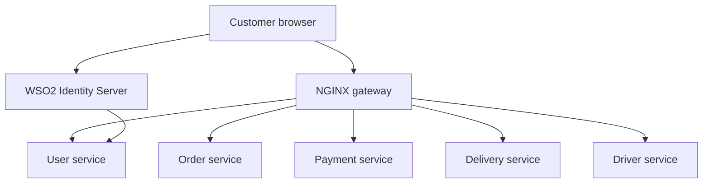

# CraveDrop Secure

A secured version of the CraveDrop food-ordering and delivery platform. This repository is the modified submission for the Secure Software Development assignment.

## Assignment links

- Original vulnerable project: <https://github.com/nmdra/CraveDrop>
- Modified secure project: <https://github.com/nmdra/CraveDrop-Secure-SSD>
- Immutable vulnerable baseline: `cb68a377f5b8cdc3b12f86883ac6fb703ef5e405`
- Baseline tag: `baseline-vulnerable`
- Report: [`report/Report.pdf`](report/Report.pdf)
- Video: **PENDING**. Add the final unlisted YouTube URL before submission.

## Team

| Member | Registration number |
|---|---|
| Hansaja A. M. G | IT22171856 |
| Dharmasiri I. D. N. D | IT22254320 |
| Sanjeewa P. D. L. B | IT22629708 |
| Aluthwaththa A. W. D. S. M | IT22267290 |

## Security work

Seven distinct vulnerabilities were reproduced against the immutable baseline, fixed, and tested with blocked-attack and authorized-control checks.

| ID | Security issue | Secure result |
|---|---|---|
| V1 | Missing payment authentication | Payment actions require an authenticated customer. |
| V2 | Order IDOR/BOLA | Order access is scoped to the verified owner. |
| V3 | Order mass assignment | Sensitive order fields are server-owned and rejected from client updates. |
| V4 | Unauthorized delivery mutation | Only the assigned driver can make valid delivery updates. |
| V5 | Broken driver administration authorization | A driver can update only their own availability. |
| V6 | Payment amount and state manipulation | The server calculates totals and owns payment state. |
| V7 | Token exposure and session design | Browser sessions use strict HttpOnly cookies without bearer-token JSON or storage. |

### V4-V6 delivery and payment controls

The delivery mutation routes authenticate a signed actor before the controller compares that identity with the driver stored on the delivery. Status changes also pass through an explicit transition map, preventing skipped or reversed fulfilment states. Driver availability updates apply the same identity-to-record check so one driver cannot modify another driver's status.

Order creation treats the product catalogue as the pricing authority. The service calculates totals from stored product prices, fixes the currency to USD, and creates card orders in the pending state regardless of conflicting client fields. Later payment confirmation must remain tied to trusted order data and a verified provider event.

The primary implementation surfaces are:

- `delivery-service/src/middleware/authMiddleware.js` and `delivery-service/src/controllers/deliveryController.js`
- `driver-service/src/middleware/authMiddleware.js` and `driver-service/src/controllers/driverController.js`
- `order-service/src/controller/order.controller.js`
- `security-tests/runtime-v4-v7.mjs` and `security-tests/regression-v4-v7.mjs`

The project also adds one customer login feature using WSO2 Identity Server 7.1.0 and OpenID Connect Authorization Code flow with S256 PKCE.



## Evidence and documentation

- [`docs/finding-matrix.md`](docs/finding-matrix.md): finding, evidence, test, and commit index.
- [`docs/report-notes.md`](docs/report-notes.md): report source notes and residual risks.
- [`docs/oidc-setup.md`](docs/oidc-setup.md): local WSO2 setup and security controls.
- [`docs/contributions.md`](docs/contributions.md): group work allocation and evidence.
- [`docs/video-runbook.md`](docs/video-runbook.md): 17–18 minute demonstration plan.
- [`docs/submission-checklist.md`](docs/submission-checklist.md): clean-clone and ZIP checks.

## Local development

### Prerequisites

- Docker and Docker Compose
- Node.js 20 for the OIDC mocked regression test
- Local test configuration only. Never commit `.env` files, credentials, cookies, or tokens.

### Start the application

1. Copy each required `.env.example` file to an ignored local `.env` file.
2. Add only local test values.
3. Start the core services:

   ```bash
   docker compose up --build
   ```

4. Start WSO2 for the OIDC demonstration:

   ```bash
   docker compose --profile oidc up wso2is
   ```

5. Follow [`docs/oidc-setup.md`](docs/oidc-setup.md) to register the local OIDC client and synthetic customer.

## Security verification

```bash
# Create and verify deterministic synthetic fixtures.
node scripts/seed-security-fixtures.mjs reset
node scripts/seed-security-fixtures.mjs verify

# Run source-level guards for all seven remediations.
node security-tests/regression-v1-v3.mjs
node security-tests/regression-v4-v7.mjs

# With the Compose services and synthetic fixtures running, exercise the
# blocked attacks and authorized controls. Use the same local-only JWT secret
# configured for the affected services.
JWT_SECRET="$LOCAL_JWT_SECRET" node security-tests/runtime-v1-v3.mjs
JWT_SECRET="$LOCAL_JWT_SECRET" node security-tests/runtime-v4-v7.mjs

# Run OIDC checks under Node 20.
node security-tests/regression-oidc.mjs
NODE_ENV=development node security-tests/oidc-mocked.mjs
```

The evidence uses synthetic fixtures and redacted values only. ZAP and Trivy findings are recorded separately as supporting scanner evidence. Dependency and base-image advisories are not counted as application vulnerabilities without reproduced impact. The bounded ZAP scan completed with a remaining CSP policy-completeness residual risk documented in `evidence/tools/zap-summary.md`.

## Licence

MIT. See [LICENSE](LICENSE).
