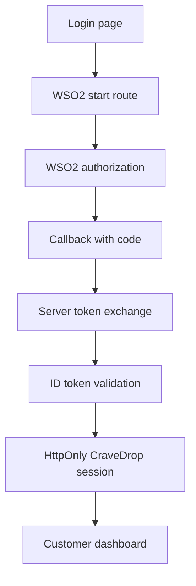

# Local WSO2 Identity Server login

This document describes the local demonstration only. Do not commit WSO2 administrator credentials, client secrets, certificates, tokens, or `.env` files.

## Start WSO2

The Compose service is pinned to WSO2 Identity Server `7.1.0` and uses the `oidc` profile:

```bash
docker compose --profile oidc up wso2is
```

The local management and OIDC endpoint is exposed at `https://localhost:9443`. WSO2 uses a development certificate. Trust that certificate only in the local browser and local Node.js process. Do not disable TLS verification globally. When a local CA file is available, use:

```bash
export NODE_EXTRA_CA_CERTS=/path/to/local-wso2-ca.pem
```

The service uses a named `wso2is_data` volume. Remove that local volume only when intentionally resetting the development identity server.

## Register the application

In the WSO2 management console, register one OIDC web application named `cravedrop-web` with:

- **Grant:** Authorization Code
- **PKCE:** S256
- **Redirect URI:** `http://localhost:3001/api/user/auth/wso2/callback`
- **Allowed post-login URI:** `http://localhost:5173/dashboard`
- **Scopes:** `openid`, `email`, `profile`
- **Client authentication:** confidential web application

In **Claim configuration**, keep the **LOCAL** dialect. Add these local claims as requested claims: `http://wso2.org/claims/emailaddress`, `http://wso2.org/claims/identity/emailVerified`, `http://wso2.org/claims/givenname`, and `http://wso2.org/claims/lastname`. Map them to the corresponding application claims. Confirm the OIDC `email` scope contains `email` and `email_verified`, and the `profile` scope contains the profile claims. The synthetic account should have a verified email address.

Some local WSO2 user-store configurations release only `sub` even when profile claims are configured. This feature still authenticates only the validated issuer and subject. If WSO2 does not release an email, CraveDrop creates a deterministic `@identity.invalid` placeholder. It never infers, trusts, or automatically links an email address in that case.

Store the generated client ID and secret in the ignored local `user-service/.env` file. Copy the variable names from `user-service/.env.example` and generate a separate `OIDC_FLOW_SECRET`.

The user service uses these local discovery values:

```text
OIDC_DISCOVERY_URL=https://localhost:9443/oauth2/token/.well-known/openid-configuration
OIDC_ISSUER=https://localhost:9443/oauth2/token
OIDC_REDIRECT_URI=http://localhost:3001/api/user/auth/wso2/callback
OIDC_SUCCESS_REDIRECT_URI=http://localhost:5173/dashboard
```

Confirm the actual issuer and endpoint values from WSO2 discovery before starting the user service. The callback URI must match exactly.

## Run the feature

Start the user service with its runtime environment and then open the CraveDrop login page. Select **Continue with WSO2**.



The callback receives a short-lived authorization code. WSO2 tokens are exchanged and validated by the user service. They are not placed in the browser URL, response JSON, or browser storage.

## Validation and reset

The callback validates:

- state and the signed short-lived flow cookie;
- S256 PKCE verifier;
- nonce;
- discovery issuer and JWKS signature;
- ID-token issuer, audience, algorithm, and expiry;
- a subject; and, if WSO2 supplies an email, a verified email claim.

The local user record is keyed only by issuer and subject. A provider email collision is rejected, and an absent email is represented by a deterministic non-deliverable placeholder.

A WSO2 identity is keyed by issuer and subject in the CraveDrop user record. If the email already belongs to a local account, automatic linking is rejected. Account linking is outside this assignment feature.

For a clean demonstration, use a new synthetic WSO2 user email. Revoke the client in WSO2 and remove the local client secret when the demonstration ends. Never copy cookies, authorization codes, ID tokens, or client secrets into evidence.
